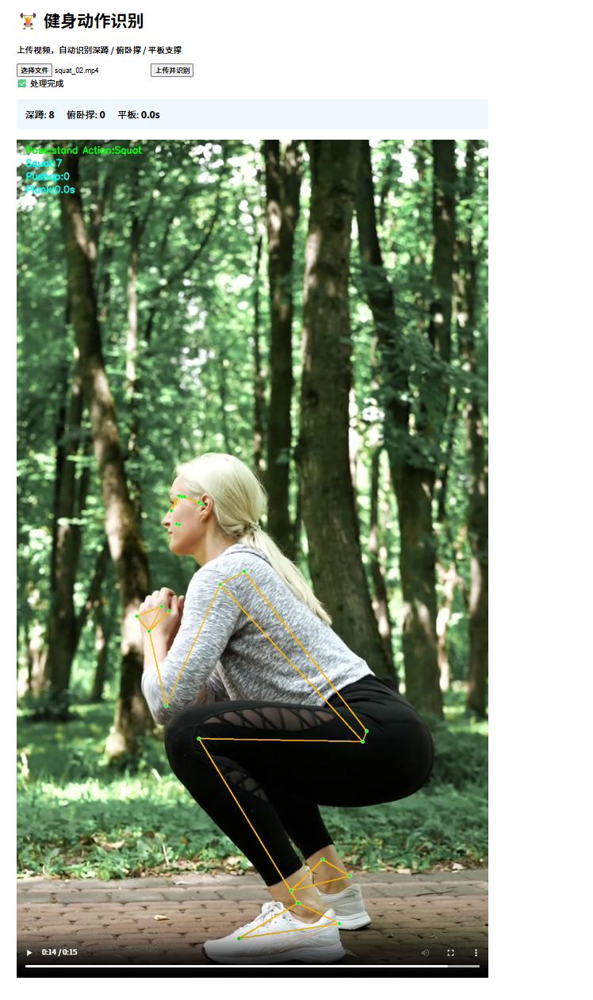
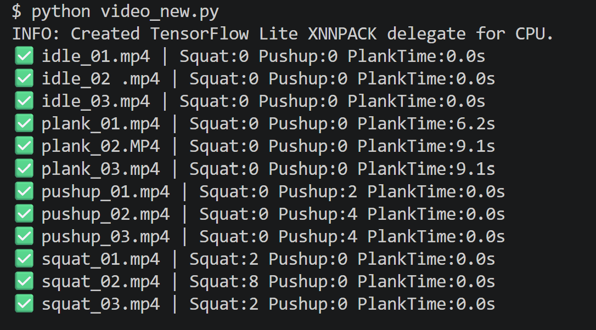
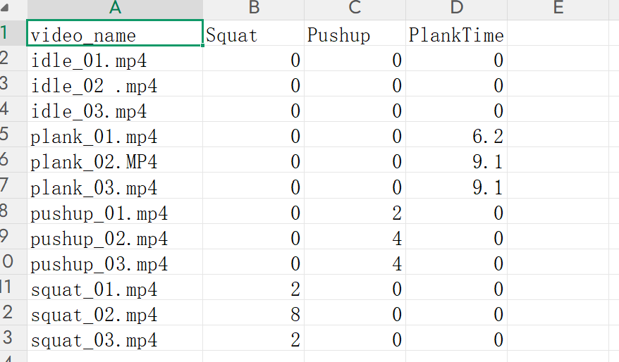

# Human-Pose-Fitness-Count

基于 MediaPipe Pose 的轻量化健身动作识别与计数工具，支持批量视频处理与 Web 端在线推理。

## 效果展示

### Web 端演示



### 批量处理输出



## 项目概述

本项目借助 MediaPipe Pose 预训练姿态模型提取人体 33 个 2D 骨骼关键点，通过计算关节夹角，结合**多级状态机 + 帧级防抖**，完成三类健身动作的识别与统计：

- **深蹲（Squat）**：重复计数
- **俯卧撑（Pushup）**：重复计数
- **平板支撑（Plank）**：有效保持时长

程序支持批量读取文件夹内视频进行姿态推理，输出叠加人体骨架与动作计数的标注视频，并将每条视频的识别结果保存至 CSV 表格。

同时提供 **Flask Web 端**，支持浏览器上传视频、在线推理、实时展示标注视频与统计结果。

## 项目文件结构

```text
Human-Pose-Fitness-Count/
├── README.md
├── requirements.txt
├── .gitignore
├── app.py                     # Flask Web 应用
├── video_new.py               # 主程序：批量视频处理
├── image_pose.py              # 单张图片关键点检测
├── utils/
│   └── pose_utils.py          # 工具模块：角度计算、姿态分类、状态机
├── templates/
│   └── index.html             # Web 前端页面
├── docs/                      # README 展示图片
├── archive/                   # 早期迭代版本
├── images/                    # 测试图片
├── videos/                    # 原始测试视频
└── output/                    # 标注视频与 CSV 统计结果
```

## 环境依赖

Python >= 3.9

```bash
pip install -r requirements.txt
```

`requirements.txt`：

```text
mediapipe==0.10.14
opencv-python
numpy
flask
```

## 运行方式

### 1. 命令行批量处理

```bash
python video_new.py
```

自动遍历 `videos/` 目录下所有 mp4 文件，结果输出到 `output/`。

### 2. Web 端交互推理

```bash
python app.py
```

浏览器打开 `http://127.0.0.1:5000`，上传视频即可在线识别。

## 技术亮点

- **多动作并行识别**：单帧同时判断深蹲、俯卧撑、平板支撑，无需人工预标记视频类型
- **姿态粗分类**：基于躯干向量与竖直方向夹角，稳定区分站立 / 俯卧姿态
- **滑动窗口稳定性判据**：利用肘角滑动窗口标准差区分"俯卧撑"与"平板支撑"，解决两类动作在 2D 投影下的混淆问题
- **多级状态机 + 帧级防抖**：连续 N 帧满足条件才切换状态，抑制关键点抖动导致的误计数
- **关键点缺失容错**：visibility 阈值过滤 + 左右关节取平均，避免单侧遮挡导致崩溃
- **模块化设计**：角度计算、特征提取、状态机独立封装，便于扩展新动作
- **端到端流程**：从视频输入 → 姿态推理 → 动作识别 → 标注视频 + CSV 结构化输出

## 算法流程

```text
输入视频
   ↓
逐帧读取 → RGB 转换
   ↓
MediaPipe Pose 推理 → 33 个 2D 关键点
   ↓
关键点像素化 + 可见性过滤
   ↓
计算关节夹角（膝角 / 肘角 / 躯干角 / 肩-髋-踝）
   ↓
姿态粗分类（站立 / 俯卧 / 仰卧）
   ↓
分支判定：
  ├── 站立 → 深蹲状态机
  ├── 俯卧 → 平板（肘角稳定） / 俯卧撑（肘角波动）
  └── 仰卧 → 仰卧起坐状态机
   ↓
叠加骨架 + 计数文本 → 输出视频
   ↓
写入 CSV 统计结果
```

## 实测结果

在 12 段横屏侧拍测试视频上的识别结果：

| 视频类型 | 数量 | 期望结果 | 系统识别 |
|---|---|---|---|
| idle（静止） | 3 | 全 0 | 0 / 0 / 0 ✅ |
| plank（平板） | 3 | 6~10s | 6.2 / 9.1 / 9.1s ✅ |
| pushup（俯卧撑） | 3 | 3~5 次 | 2 / 4 / 4 ✅ |
| squat（深蹲） | 3 | 2~10 次 | 2 / 8 / 2 ✅ |

**结论**：三类动作均能稳定识别，动作间无相互误触发。

## 关键技术细节

### 1. 为什么不用关节角度绝对值区分俯卧撑和平板？

俯卧撑撑起的瞬间肘角 ≈ 170°，与直臂平板支撑几乎一致，单帧角度无法区分。

**解决方案**：使用**肘角滑动窗口（约 1 秒）标准差**作为稳定性判据。

- 平板支撑：肘角稳定，窗口内极差 < 25°
- 俯卧撑：肘角周期震荡（100° ↔ 170°），窗口内极差 > 60°

### 2. 为什么必须先做姿态粗分类？

深蹲与俯卧撑的关节角度特征完全不同，直接判断容易混淆。通过**躯干向量与竖直方向夹角**先粗分类，再进具体动作分支，可显著降低跨动作误触发。

### 3. 2D 姿态估计的视角依赖性问题

在调试中发现：**正面拍摄的平板支撑视频无法被正确识别**。原因是 2D 投影下肩-髋-踝不在一条直线上，躯干角度失真。

**最终方案**：所有测试视频采用**横屏侧拍 + 全身入镜**，关键点可见性从 0% 提升到 95%+。

## 已知局限

1. **仅支持单人场景**：多人出现在同一画面时无法区分
2. **依赖侧面拍摄**：正面角度下平板支撑识别效果差
3. **2D 姿态限制**：无法处理严重遮挡场景
4. **平板时间偏短**：稳定判定的头尾帧被过滤，实际计时略短于真实值

**改进方向**：

- 引入时序模型（LSTM / Transformer）做动作序列分类
- 多视角关键点融合，解决遮挡与视角问题
- 增加 3D 姿态估计（MediaPipe Holistic 或 BlazePose GHUM）

## License

MIT

## 作者

个人项目 · 2024